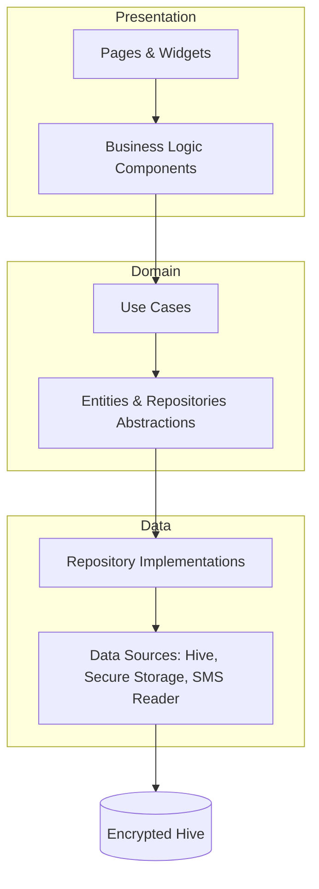

# Life Vault 🛡️

**Your Private Digital OS — Local-First, Zero-Knowledge, and Fully Encrypted.**

Life Vault is a privacy-centric personal information management system designed to serve as your digital secondary brain. Built with a "Security First" philosophy, it ensures that your most sensitive data—finances, documents, notes, and ideas—remains under your absolute control, stored locally on your device with enterprise-grade encryption.

---

## 💡 The Idea

In an era of cloud-dependency, **Life Vault** flips the script. Instead of trusting third-party servers with your life's data, Life Vault treats your device as the ultimate secure perimeter.

- **Local-First**: No data leaves your device unless you explicitly choose to sync it.
- **Zero-Knowledge**: Your master PIN/Biometrics derive the encryption keys. We (the developers) have zero access to your data.
- **Modular Ecosystem**: Everything from SMS-based expense tracking to a secure document vault in one cohesive "Digital OS".

---

## 🚀 Key Features

### 💰 1. Smart Finance Tracker
- **SMS Parsing**: Automatically detects and categorizes bank transactions from your SMS inbox (Android).
- **Expense Insights**: Visual charts (PIE/Bar) to track monthly spending.
- **Categorization**: Multi-level categories for precise budgeting.

### 🔐 2. The Vault
- **AES-256 Encryption**: Encrypts files at rest.
- **Hidden Items**: Support for "Ghost" folders accessible only via secret triggers.
- **Biometric Lock**: Seamless integration with FaceID/Fingerprint.

### 📄 3. Document Management
- **PDF Viewer**: High-performance integrated PDF reader.
- **Tagging System**: Organize documents with cross-functional tags.
- **Expiry Alerts**: Get notified before your ID, Passport, or Insurance expires.

### 📝 4. Notes & Ideas
- **Markdown Support**: Rich text notes with full markdown rendering.
- **Idea Inbox**: A dedicated space for quick thoughts with a "Like" system to prioritize projects.
- **Folder Hierarchy**: Nested folders for deep organization.

---

## 🏗️ Technical Architecture

Life Vault follows **Clean Architecture** principles to ensure scalability, testability, and independence from external frameworks.



- **Feature-Driven Structure**: Each module (Finance, Auth, Vault) is self-contained with its own data, domain, and presentation layers.
- **State Management**: Managed entirely via `flutter_bloc`.
- **Dependency Injection**: Powered by `get_it` and `injectable`.

---

## 🛠️ Technology Stack

| Category | Technology |
| :--- | :--- |
| **Framework** | Flutter (Dart) |
| **Local Database** | Hive (Encrypted) |
| **Security** | AES-256-GCM, Argon2id, PBKDF2 |
| **State Management** | BLoC / Cubit |
| **Dependency Injection** | GetIt / Injectable |
| **Visualization** | FL Chart |
| **Persistence** | Flutter Secure Storage |

---

## 📁 Project Structure

```text
lib/
├── core/               # Cross-cutting concerns (Theme, Security, Utils)
└── features/           # Modularized features
    ├── 03_auth/        # PIN, Biometrics & Security setup
    ├── 05_documents/   # Document storage & viewing
    ├── 06_notes/       # Markdown notes
    ├── 10_finance/     # SMS Parsing & Expense tracking
    └── 11_vault/       # Encrypted storage logic
```

---

## 🏁 Getting Started

### Prerequisites
- Flutter SDK (latest stable)
- Android Studio / VS Code
- Java 17+ (for Android builds)

### Installation
1. **Clone the repository**
   ```bash
   git clone https://github.com/your-username/life_vault.git
   ```
2. **Install dependencies**
   ```bash
   flutter pub get
   ```
3. **Run Code Generation** (for Injectable and Hive)
   ```bash
   flutter pub run build_runner build --delete-conflicting-outputs
   ```
4. **Run the app**
   ```bash
   flutter run
   ```

---

## 🛡️ Security Disclaimer
Life Vault is designed for privacy. If you lose your Master PIN and haven't backed up your recovery keys, your data **cannot be recovered**. We do not store keys on any server.

---

## 🗺️ Roadmap
- [ ] Cross-device encrypted sync (Zero-Knowledge).
- [ ] Desktop support (Windows/macOS).
- [ ] AI-powered transaction categorization.
- [ ] Encrypted Cloud Backup (Google Drive/S3).

---
*Created with ❤️ by the Global Personal OS Team.*
